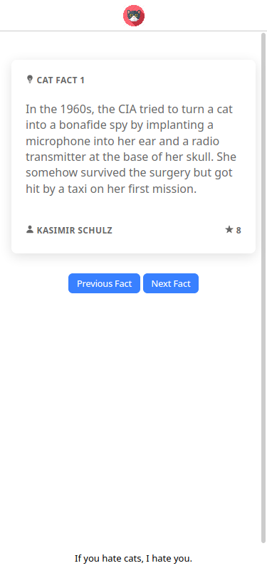

# Cat Facts App

This project fetches data from cat facts API and displays them.

To run this project, clone this repo and run the following commands

```sh
npm i -g @ionic/cli
npm i
ionic serve
```

## Screenshots


